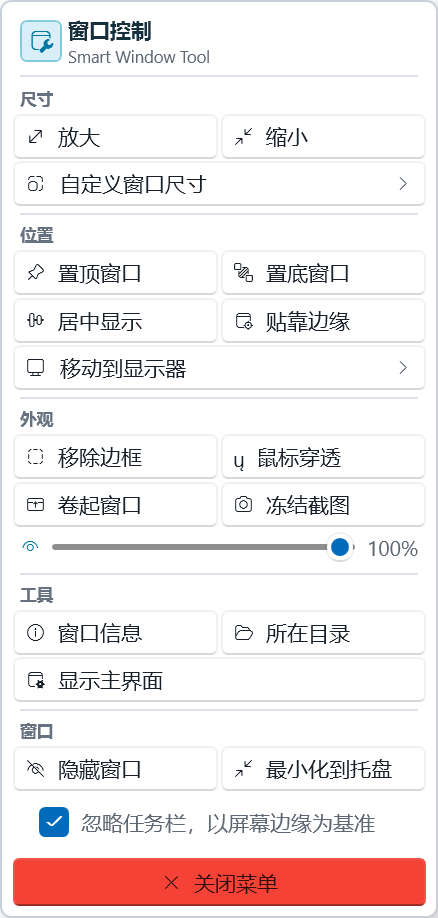

# Smart Window Tool

**Smart Window Tool** 是一个现代化的 Windows 桌面增强工具，使用 C# WPF 和 .NET 8 重写自开源项目 [SmartContextMenu](https://github.com/AlexanderPro/SmartContextMenu)。它提供了一套强大的全局窗口管理功能，可以通过快捷键在你鼠标悬停的任意窗口上呼出一个智能右键菜单。

## 🌟 核心功能

- **快捷呼出菜单**：通过自定义的快捷键（默认：`Ctrl` + `鼠标右键`），随时随地呼出窗口管理菜单。
- **自定义窗口尺寸**：一键将目标窗口缩放至常用的分辨率（如 1920x1080, 1280x720 等），并且支持手动添加和删除自定义尺寸。
- **智能窗口排版**：支持按比例扩大/缩小窗口，一键**居中显示**，以及**智能贴靠边缘**（自动吸附最近的屏幕边缘）。
- **多显示器迁移**：一键将当前窗口**移动到指定显示器**，多屏党必备。
- **窗口层级管理**：一键设置目标窗口**置顶（始终在最前）**或**置底**。
- **外观与状态调整**：
  - **透明度平滑微调**：按住 `Ctrl + Shift` 并在任意窗口上**滚动鼠标滚轮**，即可细腻平滑地调节该窗口的透明度（10%~100%）。
  - **移除/恢复边框**：一键剥离目标窗口的系统边框（适合看视频或极简模式）。
  - **冻结为悬浮截图**：将当前窗口瞬间“拍快照”并固定为置顶的无边框图像，适合对照抄代码或看数据，按 `ESC` 或右键即可关闭。
  - **鼠标穿透**：开启后鼠标将直接点击到该窗口下方的元素（注意：一旦开启，需通过主界面或重启软件才能恢复）。
  - **卷起窗口**：将窗口内容隐藏，只保留一个细小的标题栏区域（Roll Up）。
- **进程黑名单防误触**：在设置中添加不需要响应快捷键的进程（如 `LeagueOfLegends.exe`），彻底杜绝游戏中误触菜单。
- **强制最小化到托盘**：可将任意不支持托盘化的老旧软件或游戏，强行从任务栏抹除并隐藏到右下角托盘（老板键）。
- **开发者辅助**：
  - 一键查看当前窗口的底层信息（原生 WPF UI 展示句柄、标题、类名、进程 PID、进程路径，支持一键复制）。
  - 一键在资源管理器中定位并打开该程序所在的文件夹。
- **静默后台与提权**：
  - 支持**开机自启动**和**完全静默启动**。
  - 支持**以管理员权限运行**，完美穿透《崩坏：星穹铁道》等带有反作弊保护的高权限游戏。

## 🚀 安装与运行

本项目打包为**框架依赖的单文件 (Framework-Dependent Single File)**。体积非常小巧（仅约 3MB）。

### 环境要求
- 运行前请确保你的电脑上安装了 **[.NET 8 Desktop Runtime (Windows 桌面运行时)](https://dotnet.microsoft.com/zh-cn/download/dotnet/8.0)**。

### 使用方法
1. 前往 `Releases` 页面下载最新版的 `SmartWindowTool.exe`。
2. 双击运行程序，会自动在右下角系统托盘生成一个图标。
3. 把鼠标光标放在你想要操作的任意窗口上，按下 `Ctrl + 鼠标右键` 即可呼出悬浮菜单。

## ⚙️ 设置与配置

你可以随时左键单击右下角的托盘图标，打开主界面来修改配置：
- **自定义触发快捷键**：支持勾选 `Ctrl`、`Shift`、`Alt`，并组合鼠标的 `左键`、`中键`、`右键` 作为触发器。
- **开机自启动**：开启后，软件会在每次电脑开机时自动在后台启动。
- **静默启动**：开启后，双击运行软件将不会弹出主界面，直接隐匿在托盘运行，实现完全无感。
- 配置文件将自动存储在系统标准应用目录中：`%AppData%\SmartWindowTool\SmartWindowTool.json`。

## 🛠️ 技术栈
- **C# / .NET 8**
- **WPF** + **WPF-UI (Fluent Design / Mica 材质)**
- **Win32 API Interop** (User32.dll)
- **Global Mouse/Keyboard Hooks** (全局键鼠钩子)

## 📄 协议
本项目基于 MIT License 协议开源。
